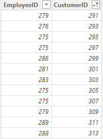

# Client Portfolio Problem

This was a Power BI/DAX problem that I solved in my work, i tought that was i quite interest problem so I decided to make a linkedin post about it and this git repo to make available the dataset and the resolution to other people try to solve.

## The problem

The problem was basically to create a new table showing the portfolio of clients that each salesperson have.
An example of the table: 

Being the first column, the salesperson id, and the second, the customer id that is in the portfolio of the current salesperson.

But to create this table must follow two rules:

1. The customer goes to the wallet of the seller where he had the most orders
2. if this is tied, it remains in the wallet of the seller who had the most recent sale.

Obs:
- I'm considering the numbers of orders, the distinct count of SalesID column.
- The date column is the OrderDate.

## Dataset

The dataset folder contains 3 files:
- customers.csv 
- employees.csv
- orders.csv

Originated of the AdventureWorks database, downloaded using this github repo: [AdvetureWorksDataset](https://github.com/sfrechette/adventureworks-neo4j/tree/master/data)

You can use this file to try to solve the problem with Power BI or any tool you want.

## Solution

1. I created a virtual table grouping the salesperson and the client using the SUMMARIZECOLUMNS function.
2. I calculated a ranking ordered by total orders and most recent sale and partitioned by customer to ensure the rankings reset for each customer.
3. Filtered all the first positions of the rank

I created three files showing the DAX code of three different solutions for the problem, they are in the solutions folder.
And made available the pbix file with resulting tables inside.

